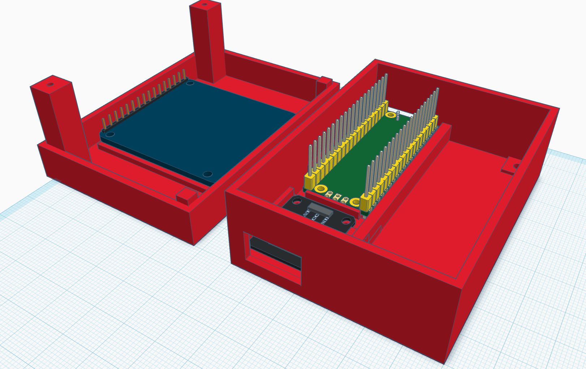

# Temperature Sensor Repo

My goal with this repo is to provide everything needed for someone to construct and stand up one of the temperature sensor boxes.  This includes the box design, hardware specs, and code.  I will try my best to move in major version chunks together, so that if I make a design change, it is directly reflected in the code, hardware, design, etc., all at once.  Then someone can download a single release and get everything.

# Basics

The temperature sensor kits use this hardware:
- Raspberry Pico W (https://www.amazon.com/dp/B0BMP5546H)
- DS18x20 temperature sensors (https://www.amazon.com/dp/B09NVFJYPS)
- Convenient DS18x20 breakout boards (https://www.amazon.com/dp/B09NVWNGLQ)
- A 1.8", 128x160, ST7735r color LCD screen (https://www.amazon.com/dp/B00LSG51MM)
- Some short female-to-female jumper cables (https://www.amazon.com/dp/B0BRTKTV64)
- Short female-to-dual-female splitter jumper cables (https://www.amazon.com/dp/B0DSZWFS1V)
- Screws - I will update this with exact sizes soon, and include links to them

I use Tinkercad to design my 3D printed boxes.  I will try to keep a link to the design up to date here, but for now this is an image:

I use a very small Tina2S 3D printer to print the boxes. (https://www.amazon.com/dp/B0CMHM6XQG)  It has a very small print area, which has forced me to rethink the design multiple times.  For better or for worse.
 
# Assembly Instructions

- Grab the 3D models, parts list, and code from a specific revision.
- Print the base and lid and order the parts
- Test fit the screen, breakout board, and pico, checking screw holes
- Screw in Pico with 3 M2x6mm screws
- If the temperature sensors are new, make sure to run the src/print_rom.py script to get the ROM code for that sensor
- Use wire strippers on the temperature sensor(s) to trim back the covering, and then strip the wires and give a good amount to hold in the sensor
- Add jumper cables to the sensor, preferably brown ground, and yellow for data, and then one of the wire splitter ends on the vcc
- Unscrew the breakout board terminal screws to open the ports, then screw the sensor(s) wires into the sensor breakout board tightly (yellow DAT, red VCC, black GND)
- Feed wires through and screw into place with 2 M3x5mm screws
- Attach 7 jumper wires to Pico GP21 - GP16, which will all wire to the screen
- Also for debugging add a jumper from GP22 to GND
- Attach screen wires, and attach the VCC splitter end to the screen
- Attach the 3 remaining wires (2 sensor and 1 splitter) to the pico
- Flash the Pico with MicroPython - I'm using 1.27.0 because that's what Thonny currently defaults to
- In Thonny, browse the file sidebar for the code locally on your machine, then find config.py, sensing.py, main.py and st7735.py, and on each one, choose "Upload to /" to copy them to the Pico
- Go into the config.py file and update the attached sensors and configuration as needed
- With the debugging jumper attached, execute sensing.py and see what happens
- Update config.py to have the right github frequency, wifi networks, and github token
- Unhook the debugging jumper
- Screw screen to lid using 3 M2.3x5mm screws
- Test fit led-to-base screws with 2 M2.3x10mm screws
  - The plastic sometimes clogs the holes, so plunge the screws all the way through the base holes first
- Then snap lid into place, screw them in to tighten it
- Re-run main.py to test it out, it should start executing right away (verifies you didn't leave the debugging jumper on)
- Deploy!
